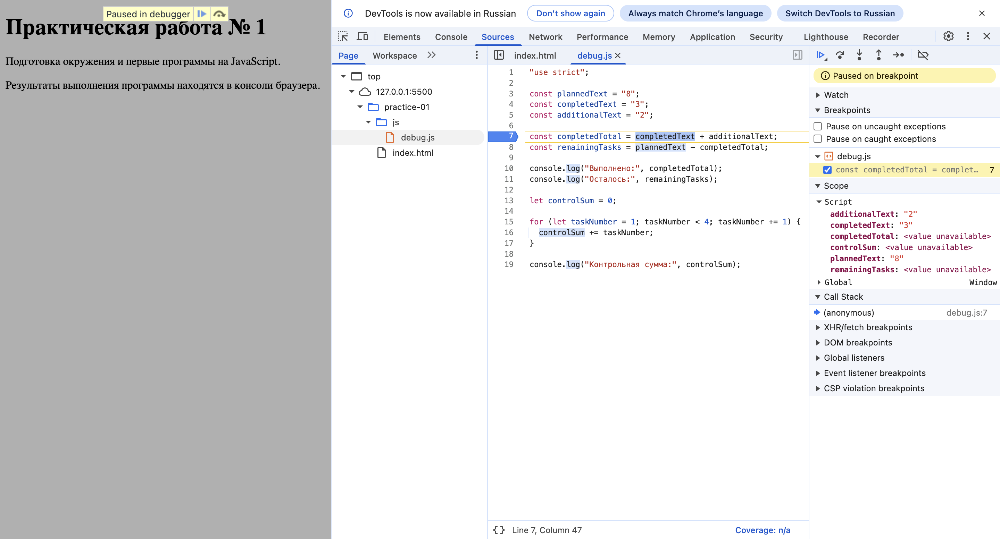

# Практическая работа №1. Основы языка JavaScript и работа с Git

* **Студент:** Захаркина Наталья Дмитриевна
* **Группа:** ЭФБО-04-25
* **Вариант:** 6


## 1. Сведения об окружении
* **Операционная система:** macOS
* **Версия Node.js:** 24.21.0
* **Версия npm:** 11.19.0
* **Версия Git:** 2.33.0


## 2. Результаты выполнения заданий

### Задание 1. Проверка сред выполнения
* **Вывод в Node.js (терминал):** `Тип document: undefined`
* **Вывод в браузере (консоль DevTools):** `Тип document: object`
* **Вывод:** Среда Node.js является серверной и не имеет встроенных объектов для работы с веб-страницами (таких как `document`), поэтому его тип `undefined`. Браузерная среда предназначена для работы с HTML-документами, поэтому там этот объект существует и имеет тип `object`.

### Задание 2. Исследование типов и преобразований

| № | Выражение | Значение | Тип | Объяснение |
|---|---|---|---|---|
| 1 | `"8" + 2` | `"82"` | `string` | Конкатенация. Оператор `+` при встрече со строкой склеивает данные в текст. |
| 2 | `"8" - 2` | 6 | `number` | Оператор `-` не работает со строками и автоматически приводит `"8"` к числу. |
| 3 | `Number("8") + 2` | 10 | `number` | Явное преобразование строки в число 8 с последующим сложением. |
| 4 | `"12" > "3"` | `false` | `boolean` | Посимвольное сравнение строк. Первый символ `"1"` меньше, чем `"3"`. |
| 5 | `12 === "12"` | `false` | `boolean` | Строгое равенство проверяет и значение, и тип. Число не равно строке. |
| 6 | `Number("")` | 0 | `number` | Пустая строка при явном преобразовании в число всегда возвращает 0. |
| 7 | `Number("text")` | `NaN` | `number` | Строку с текстом невозможно преобразовать в число, возвращается `NaN`. |
| 8 | `Boolean("false")` | `true` | `boolean` | Любая непустая строка в JS при логическом приведении даёт `true`. |
| 9 | `typeof null` | `"object"` | `string` | Исторический баг дизайна JS. `typeof` возвращает текстовый результат `"object"`. |
| 10 | `typeof NaN` | `"number"` | `string` | `NaN` технически относится к типу `number`. `typeof` возвращает строку `"number"`. |

### Задание 3. Расчет прогресса задач
* **Входные данные:** `totalTasks = 18`, `completedTasks = 6`
* **Фактический вывод программы:**
  ```text
  Всего задач: 18
  Выполнено: 6
  Осталось: 12
  Прогресс: 33.3%
  Статус: В работе
  ```

### Задание 4. Пошаговое планирование
* **Входные данные:** `totalTasks = 18`, `completedTasks = 6`, `dailyLimit = 5`
* **Фактический вывод программы:**
  ```text
  Осталось задач: 12
  День 1: выполнено 5, осталось 7
  День 2: выполнено 5, осталось 2
  День 3: выполнено 2, осталось 0
  Потребуется дней: 3
  ```

### Задание 5. Исправление логических ошибок (Отладка)
В ходе выполнения задания были обнаружены и исправлены две ошибки:
1. **Обработка количества задач:** Строковые переменные склеивались оператором `+` (`"3" + "2" = "32"`). Было добавлено явное приведение типов с помощью `Number()`.
2. **Граница цикла:** Из-за строгого условия `< 4` цикл не учитывал четвертую задачу. Было исправлено на нестрогое неравенство `<= 4`.

#### Иллюстрация остановленной программы (Точка останова)


#### Фактический вывод после исправления:
```text
Выполнено: 5
Осталось: 3
Контрольная сумма: 10
```


## 3. Дополнительное задание (Вариант А)
Было реализовано расширение, обрабатывающее входные данные в виде строк (файл `progress-input.js`). Перед вычислениями строки очищаются методом `.trim()`.

* **Ответ на контрольный вопрос:** Почему недостаточно просто вызвать `Number()` и проверить, что результат неотрицателен?
* **Ответ:** Функция `Number()` преобразует пустые строки `""`, строки из пробелов `"   "`, а также значение `null` в число `0`. Из-за этого программа приняла бы некорректный пустой ввод за правильное нулевое число задач. Для предотвращения этого необходимы предварительные строкие проверки типов и пустых строк.